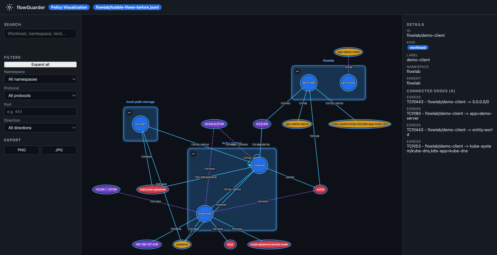

<p align="left"></p>

# flowGuarder

**Kubernetes network flow analysis**

flowGuarder is a Go CLI that analyzes Kubernetes network flow logs from Hubble (Cilium) and Calico (including the Calico Goldmane gRPC API), aggregates them into traffic patterns, detects anomalies, and generates Kubernetes NetworkPolicy and CiliumNetworkPolicy YAML manifests. It runs completely offline: no cluster connectivity, no kubeconfig, no Kubernetes API access required. Flow logs can be captured once (via `hubble observe` or similar tools) and analyzed anywhere — including on an analyst laptop in an air-gapped environment.

Output is deterministic: keys and slices are sorted, so repeated runs on the same input always produce the same manifests.

---

## Features

- **100% offline / air-gapped** — zero cluster connectivity, no kubeconfig, no Kubernetes API access. Analyze flow logs captured elsewhere on any machine.
- **Multiple input formats** — Hubble JSON, Calico JSON, Calico Goldmane proto3 JSON. Source type is auto-detected by probing the first 4096 bytes of each file (`"verdict"` = Hubble, `"action"` = Calico, `"flow"` + `"sourceName"` = Goldmane).
- **Live mode** — stream from a Hubble Relay gRPC endpoint or tail a Calico flow log file for continuous analysis.
- **Anomaly detection** (7 detectors) — port-scan, rare-flow, asymmetric traffic, dropped flows, public egress, cross-namespace, TLS / unknown domain.
- **NetworkPolicy + CiliumNetworkPolicy generation** — deterministic policy manifests with optional default-deny stubs, symmetric ingress/egress rules (egress flows mirrored as destination ingress rules), and kube-apiserver sentinel rules (matching TCP/6443 and related ports to the apiserver CIDR).
- **Insight reports** — `--report` flags for top-flows, coverage, uncovered, egress-world, drops, and anomalies. Controlled via `--top-n` and `--generate-uncovered`.
- **Policy visualization** — generates a self-contained interactive HTML graph (`flowguarder-visualization.html`) alongside the policy manifests, rendering namespaces, workloads, reserved peers and CIDRs as nodes with labeled protocol/port edges. Includes search, filtering, namespace collapse/expand, node details, and PNG/JPG export — fully offline (Cytoscape.js + dagre inlined, no CDN).
- **Config-driven thresholds** — YAML config file for per-cluster customisation of CIDRs, excluded namespaces, detector thresholds, allowlists, and namespace profiles.
- **Deterministic output** — all keys and slices are sorted; repeated runs on identical input produce identical manifests.

---

## How it works

1. **Parse** — flowGuarder reads flow JSON from a file, directory, stdin, or live stream, auto-detecting the parser to use.
2. **Classify** — Each flow endpoint is classified (pod, world, apiserver, DNS) and assigned a `PeerType` and direction (ingress / egress / internal).
3. **Aggregate workloads** — Flows are grouped by source and destination workload IDs (`namespace/name`).
4. **Compute patterns** — Flow aggregates are keyed by (source, destination, port, protocol) with byte and packet counts.
5. **Detect anomalies** — Seven pure-function detectors scan the classified flows for policy violations.
6. **Build policies** — The abstract policy model is rendered into Kubernetes-Native `NetworkPolicy` or `CiliumNetworkPolicy` manifests.
7. **Write manifests** — YAML files are written to the output directory, one per workload.
8. **Print reports** — Selected report sections are printed to stdout (top-flows, coverage, drops, etc.).

---

## Visualization

When `--output` is set (and `--skip-visualize` is not used, which is the default), flowGuarder also generates a self-contained HTML visualization file named `flowguarder-visualization.html` alongside the policy YAMLs. This file renders the analyzed traffic as an interactive graph:

- **Nodes** — namespaces appear as grouped containers; workloads are displayed inside their namespace; reserved peers (`world`, `cluster`, `host`, `remote-node`, `kube-apiserver`) and raw CIDRs are shown as distinct ungrouped nodes.
- **Edges** — every traffic flow is an edge connecting source to destination, labeled with `protocol/port`. Direction (ingress/egress) is encoded by the edge colour and arrow.
- **Interactions** — zoom and pan the graph, type to search workloads by name, and filter by namespace, protocol, port, or direction. Click any node to open a side panel with workload details and the rules that apply to it. Namespaces can be collapsed or expanded to reduce visual clutter.
- **Export** — PNG and JPG screenshots can be exported directly from the browser.
- **Offline** — the file is fully self-contained: Cytoscape.js and the dagre layout engine are inlined (no external CDN) — it works without any network connection.

```console
$ flowguarder analyze flows.jsonl --output ./out
# then open out/flowguarder-visualization.html in any browser

$ flowguarder live --hubble-server 127.0.0.1:4245 --output ./out
# same output directory, visualization is generated when --output is set
```



---

## Installation

### Pre-built binaries

Download the latest release for your platform from [GitHub Releases](https://github.com/flowguarder/flowguarder/releases).

---

## Quick start

Analyze a single Hubble JSON log file:

```console
$ flowguarder analyze hubble-flows.jsonl
=== flowGuarder Analysis Report ===
Flows parsed:      7551
Workloads:         6
Policies:          5
------------------------------------
====================================
```

Analyze all JSONL files in a directory:

```console
$ flowguarder analyze flows/
=== flowGuarder Analysis Report ===
Flows parsed:      13195
Workloads:         6
Policies:          5
------------------------------------
====================================
```

Pipe logs from stdin:

```console
$ cat hubble-flows.jsonl | flowguarder analyze -
=== flowGuarder Analysis Report ===
Flows parsed:      7551
Workloads:         6
Policies:          5
------------------------------------
====================================
```

Force a specific parser and emit JSON:

```console
$ flowguarder analyze calico-flows.log --source calico --format json
```

---

## Usage

### `flowguarder analyze [path]`

Offline analysis of flow log files, directories, or stdin (via `-`).

```console
$ flowguarder analyze flows.jsonl --output ./policies --report top-flows --report coverage --top-n 5
```

| Flag | Description | Default |
|---|---|---|
| `--config` | Path to YAML config file | (none) |
| `--source` | Flow source type: `auto`, `hubble`, `calico`, `goldmane` | `auto` |
| `--output` | Output directory for policy YAML manifests | (none — skip writing) |
| `--format` | Report output format: `text`, `json`, `both` | `text` |
| `--strict` | Disable safety margins for policy generation | `false` |
| `--default-deny` | Add deny-all stub policies | `false` |
| `--policy-format` | Policy output format: `auto`, `np`, `cnp` (auto: Hubble → CNP, Calico/CalicoSyslog/Goldmane → NP) | `auto` |
| `--cilium` | _(hidden, legacy alias for `--policy-format=cnp`)_ | `false` |
| `--dry-run` | Only validate input, do not generate output | `false` |
| `-r, --report` | Repeatable report type: `top-flows`, `uncovered`, `coverage`, `egress-world`, `drops`, `anomalies` | (none) |
| `--top-n` | Number of top entries in reports | `10` |
| `--generate-uncovered` | Generate additional policies for uncovered traffic (requires `--output`) | `false` |
| `--skip-visualize` | Skip generating flowguarder-visualization.html | `false` |

### `flowguarder live`

Stream live flows and run the same analysis pipeline. Either `--hubble-server` or `--calico-file` must be provided.

```console
$ flowguarder live --hubble-server 127.0.0.1:4245 --default-deny
$ flowguarder live --calico-file /var/log/calico/flows.json
```

| Flag | Description | Default |
|---|---|---|
| `--hubble-server` | Hubble Relay gRPC server address (`host:port`) | (none — required if no `--calico-file`) |
| `--calico-file` | Calico flow log file to tail | (none — required if no `--hubble-server`) |

Inherited from the root command:

| Flag | Description | Default |
|---|---|---|
| `--config` | Path to YAML config file | (none) |
| `--source` | Flow source type | `auto` |
| `--output` | Output directory for policy YAML manifests | (none) |
| `--format` | Report output format | `text` |
| `--strict` | Disable safety margins | `false` |
| `--default-deny` | Add deny-all stub policies | `false` |
| `--policy-format` | Policy output format (`auto`, `np`, `cnp`; default `auto`) | `auto` |
| `--cilium` | _(hidden, legacy alias for `--policy-format=cnp`)_ | `false` |
| `--kubeconfig` | Path to kubeconfig for dry-run diff (hidden) | (none) |
| `-r, --report` | Repeatable report type: `top-flows`, `uncovered`, `coverage`, `egress-world`, `drops`, `anomalies` | (none) |
| `--top-n` | Number of top entries in reports | `10` |
| `--generate-uncovered` | Generate additional policies for uncovered traffic (requires `--output`) | `false` |
| `--skip-visualize` | Skip generating flowguarder-visualization.html | `false` |

Ctrl-C or SIGTERM gracefully stops the stream.

### `flowguarder version`

Prints the flowguarder version.

```console
$ flowguarder version
1.0.0
```

---

### Choosing NetworkPolicy vs CiliumNetworkPolicy

By default, flowGuarder picks the policy type automatically based on the input source:

| Input source | Default output | Override with |
|---|---|---|
| Hubble JSON | `CiliumNetworkPolicy` (`cnp`) | `--policy-format=np` |
| Calico JSON / CalicoSyslog | `NetworkPolicy` (`np`) | `--policy-format=cnp` |
| Goldmane (proto3 JSON) | `NetworkPolicy` (`np`) | `--policy-format=cnp` |

Use `--policy-format=np` to force standard Kubernetes `NetworkPolicy` output, or `--policy-format=cnp` to force `CiliumNetworkPolicy` regardless of input source.

> **Cilium note:** When running Cilium *with its default policy engine* (not `policy-cidr-match-mode: nodes`), generating `NetworkPolicy` manifests is **not effective** for host, remote-node, and kube-apiserver egress. Standard `NetworkPolicy` cannot address those peers. Similarly, the `egress_allow_world` expansion (reserved host / remote-node peers rendered as `0.0.0.0/0`) only works on vanilla CNI defaults or on Cilium when `policy-cidr-match-mode: nodes` is configured. On a Cilium-default cluster, use `--policy-format=cnp` (the default for Hubble input) or the legacy `--cilium` flag to get proper Cilium entity-sentinel output.

---

## Report types

Reports are optional sections printed alongside the minimal summary header (flow count, workload count, policy count). Request any combination with `-r <type>`:

| Report | Description |
|---|---|
| `top-flows` | Top flow aggregates by total bytes. Groups by (source, destination, port, protocol) and returns the top-N sorted descending. |
| `coverage` | Policy coverage: percentage of flows and bytes covered by generated policies. |
| `uncovered` | Flows not covered by any generated policy. Lists source/destination pairs and the ports involved. |
| `egress-world` | Egress flows to public/external destinations (0.0.0.0/0) grouped by workload. |
| `drops` | Dropped or denied flows, grouped and sorted by bytes. Shows the responsible policy name or drop reason. |
| `anomalies` | All detected anomalies from the seven detector plugins, sorted by severity (high first), then workload, then type. |

Multiple report types can be requested in a single invocation:

```console
$ flowguarder analyze flows.jsonl --report top-flows --report coverage --report drops --top-n 5
```

---

## Anomaly detectors

flowGuarder runs seven deterministic detectors in a fixed order. All thresholds are configurable through the YAML config.

| Detector | ID | Severity | Description |
|---|---|---|---|
| Port scan | `port-scan` | High | Source workload contacts more distinct destination ports than `port_scan_threshold` (default: 10) within the time window (`port_scan_window_seconds`, default: 10). |
| Dropped flow | `dropped-flow` | Medium | Traffic was dropped or denied by a policy. Groups all drop events per source workload. |
| Namespace | `namespace` | Low-Medium | Cross-namespace traffic outside pairs declared in `allowed_namespace_pairs`. When no pairs are configured, severity is downgraded to low (informational). |
| Public egress | `public-egress` | Medium | Egress traffic to public (non-RFC1918) IPs from workloads not covered by `public_egress_allowlist_cidrs` or `known_good_external_endpoints`. DNS (port 53) is excluded by default. |
| TLS unknown domain | `tls-unknown-domain` | Medium | TLS or HTTP flows whose L7 SNI/Host does not match any domain in `known_good_external_endpoints`. Excludes DNS query names. |
| Asymmetric traffic | `asymmetric-traffic` | Medium | Workload with egress bytes greatly exceeding ingress bytes (default ratio threshold: 10:1). CronJob-labeled and operator workloads are excluded. |
| Rare flow | `rare-flow` | Low | Flow patterns with frequency below the configured percentile threshold (`rare_flow_threshold`, default: 0.001) and occurrence count under 10. Long-tail scrapers (more than 20 distinct patterns) are excluded. |

Anomaly IDs are deterministic SHA-256 hashes derived from the detector type, workload, and description — identical input always produces identical IDs.

---

## Configuration

The config file is optional; flowGuarder applies sensible defaults when no config is provided. Pass it with `--config` or place it at `/etc/flowguarder/config.yaml`.

A fully annotated example is included in this repository as `example-config.yaml`. Key configuration keys:

```yaml
# --- Cluster CIDRs ---
# RFC 1918, RFC 4193 ULA, and CGNAT ranges used for "internal" classification.
cluster_cidrs:
  - "10.0.0.0/8"
  - "172.16.0.0/12"
  - "192.168.0.0/16"
  - "fd00::/8"
  - "100.64.0.0/10"

# --- API Server CIDRs ---
# IP ranges carrying kube-apiserver traffic.
apiserver_cidrs:
  - "10.96.0.0/12"

# --- Excluded Namespaces ---
# Infrastructural namespaces whose flows are silently ignored.
excluded_namespaces:
  - "kube-system"
  - "calico-system"
  - "tigera-operator"

# --- Kubernetes DNS Ports ---
kube_dns_ports:
  - protocol: "UDP"
    port: 53
  - protocol: "TCP"
    port: 53

# --- Anomaly Thresholds ---
rare_flow_threshold: 0.001         # Percentile 0..1 below which a pattern is rare
port_scan_threshold: 10            # Distinct ports within window before flagging
port_scan_window_seconds: 10       # Time window for port-scan detection

# --- Public Egress Control ---
public_egress_known_good:
  - "docker.io"
  - "ghcr.io"
  - "gcr.io"
  - "k8s.gcr.io"
known_good_external_endpoints:
  - "pypi.org"
  - "registry.npmjs.org"
  - "apt.ubuntu.com"
public_egress_allowlist_cidrs: []  # Allowed public CIDRs

# --- Namespace Pairing ---
# Maps source namespace to allowed destination namespaces.
allowed_namespace_pairs: {}

# --- Per-Namespace Profiles ---
per_namespace_profiles:
  production:
    allowed_targets:
      - "kube-system/kube-dns:53/udp"
    disallowed_targets:
      - "external/untrusted:443/tcp"
    required_labels:
      - "app"
      - "version"

# --- API Server Sentinel Ports ---
# apiserver_ingress_ports: ...  # Default: TCP {9443, 8443, 5443, 6443}
# apiserver_egress_ports: ...  # Default: TCP {6443}

# --- API Server Workload Selector ---
# Explicitly identify the workload treated as kube-apiserver for the
# apiserver-port override. Defaults to kube-system/kube-apiserver when present;
# when absent only reserved:kube-apiserver peers trigger the override.
# apiserver_workload_selector:
#   namespace: "kube-system"
#   name: "kube-apiserver"

# --- Node CIDRs ---
# Optional IP ranges covering cluster nodes. When set, NetworkPolicy renders
# these alongside inferred /32 node IPs for apiserver rules.
# node_cidrs:
#   - "192.168.107.0/24"

# --- Always Allow DNS ---
# Synthesize an egress rule (UDP+TCP 53 → kube-dns) for every workload
# with at least one egress rule.
# Default: true
# always_allow_dns: true

# --- Public Services ---
# Services rendered as a single match-all ingress rule.
# egress_allow_world: true on individual entries reserves the right to
# render host/remote-node egress for that service as 0.0.0.0/0.
# Default: [] (kube-dns at 53/UDP+TCP, metrics-server at 4443/TCP+10250/TCP)
# public_services:
#   - namespace: "kube-system"
#     name: "kube-dns"
#     ports:
#       - protocol: "UDP"
#         port: 53
#       - protocol: "TCP"
#         port: 53
#     egress_allow_world: true
#   - namespace: "kube-system"
#     name: "metrics-server"
#     ports:
#       - protocol: "TCP"
#         port: 4443
#       - protocol: "TCP"
#         port: 10250
#     egress_ports:                      # synthesizes an egress rule for infrastructure connections
#       - protocol: "TCP"                # outbound from this service (dual-carry 0.0.0.0/0 + entity:world)
#         port: 80
#       - protocol: "UDP"
#         port: 53
```

### Config key reference

| Key | Type | Default | Description |
|---|---|---|---|
| `cluster_cidrs` | `[]string (CIDRs)` | `["10.0.0.0/8", "172.16.0.0/12", "192.168.0.0/16", "fd00::/8", "100.64.0.0/10"]` | IP ranges considered internal (RFC 1918 + CGNAT + ULA). |
| `apiserver_cidrs` | `[]string (CIDRs)` | `["10.96.0.0/12"]` | IP ranges carrying kube-apiserver traffic. |
| `excluded_namespaces` | `[]string` | `["kube-system", "calico-system", "tigera-operator"]` | Namespaces whose flows are silently ignored. |
| `kube_dns_ports` | `[]PortSpec` | `UDP/53, TCP/53` | Well-known Kubernetes DNS ports. |
| `always_allow_dns` | `bool` | `true` | Synthesize an egress rule (UDP+TCP 53 to kube-dns) for every workload with at least one egress rule. |
| `rare_flow_threshold` | `float64` | `0.001` | Percentile (0..1) below which a flow pattern is a rare-flow anomaly. |
| `port_scan_threshold` | `int` | `10` | Number of distinct destination ports within the time window before flagging. |
| `port_scan_window_seconds` | `int` | `10` | Time window for port-scan detection. |
| `asymmetric_ratio` | `float64` | `10.0` | Egress/ingress byte ratio threshold. |
| `public_egress_known_good` | `[]string` | `[]` | Domain names known-good as legitimate egress targets. |
| `known_good_external_endpoints` | `[]string` | `[]` | FQDNs or IPs confirmed as good external egress targets. |
| `public_egress_allowlist_cidrs` | `[]string (CIDRs)` | `[]` | Public CIDR ranges considered benign external traffic. |
| `allowed_namespace_pairs` | `map[string][]string` | `{}` | Maps source namespace to allowed destination namespaces. |
| `per_namespace_profiles` | `map[string]Profile` | `{}` | Per-namespace rules: `allowed_targets`, `disallowed_targets`, `required_labels`. |
| `apiserver_ingress_ports` | `[]PortSpec` | `TCP {9443, 8443, 5443, 6443}` | Well-known ingress ports for kube-apiserver classification. |
| `apiserver_egress_ports` | `[]PortSpec` | `TCP {6443}` | Well-known egress ports to kube-apiserver. |
| `apiserver_workload_selector` | `struct` | `{namespace: kube-system, name: kube-apiserver}` | Identifies the workload treated as kube-apiserver for port override. Only one selector is supported; specifying more than one entry overwrites the previous value. |
| `node_cidrs` | `[]string (CIDRs)` | `[]` | Optional IP ranges covering cluster nodes for NetworkPolicy rendering. |
| `public_services` | `[]PublicServiceSpec` | `kube-dns (53/udp, 53/tcp), metrics-server (4443/tcp, 10250/tcp)` | Kubernetes services rendered as a single match-all **ingress** rule. Each entry has fields `namespace`, `name`, `ports`, **`egress_allow_world`** (`bool`, default `false`) — enables rendering reserved host/remote-node egress for that service as `0.0.0.0/0`, and **`egress_ports`** (`[]PortSpec`, default `[]`) — synthesizes an egress rule for outbound traffic from the service. |

---

## Building from source

Requires Go 1.25+.

Clone and build the binary:

```bash
git clone https://github.com/flowguarder/flowguarder.git
cd flowguarder
go build ./cmd/flowguarder   # produces ./flowguarder in the repo root
```

Or use the Makefile targets:

```bash
make build        # Build binary to bin/flowguarder
make test         # Run all tests (go test ./...)
make vet          # Run go vet ./...
```

Build release artifacts with GoReleaser:

```bash
goreleaser build --single-target
goreleaser release --snapshot
```

---

## Contributing

Issues and ideas are welcome. flowGuarder is licensed under the GNU General Public License v3.0 — see [LICENSE](LICENSE) for details.
